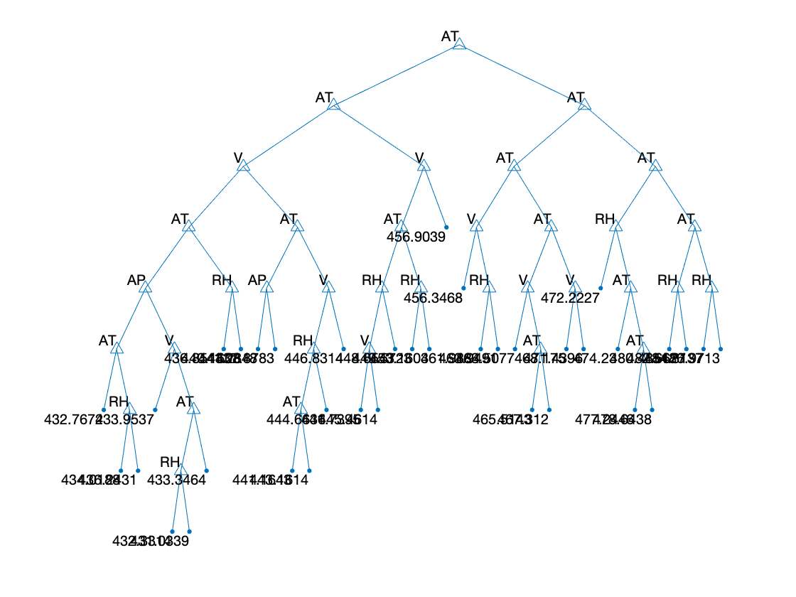

# Decision Tree Regression
Decision tree regression implementation by MATLAB.
* ID3
* C4.5


## Built With
* [MATLAB](https://ch.mathworks.com/products/matlab.html)


## Code
- main.m : The main script(entrance) of this project;
- regMain.m : The main script(entrance) of doing Regression Tree;
- createTree.m : Create the tree recursively;
- chooseBestSplit.m : Choose the best split index and value of all features;
- binSplitDataSet.m : Split the dataSet by the best split index and value(threshold);
- varianceErr.m : Function to calculate the variance of each dataSet;
- regLeaf : Function to return the value of the leaf node;
- calRMSE.m : Calculate the RMSE  between the predicted dataSet and the real dataSet;
- predictTree.m : Use the trained tree to predict data on testData;
- kCrossV.m : k-Fold Cross Validation;
- DrawDecisionTree.m : Draws the GPLAB trees graphically; This code is a copy, not original design;


## [Dataset](https://archive.ics.uci.edu/ml/datasets/Combined+Cycle+Power+Plant?ref=datanews.io)
> The dataset contains 9568 data points collected from a Combined Cycle Power Plant over 6 years (2006-2011), when the power plant was set to work with full load. Features consist of hourly average ambient variables Temperature (AT), Ambient Pressure (AP), Relative Humidity (RH) and Exhaust Vacuum (V) to predict the net hourly electrical energy output (PE) of the plant.

- plant.xlsx : The renamed dataset;

### Dataset characteristics  
- AT: Temperature in the range 1.81°C and 37.11°C
- AP : Ambient Pressure in the range 992.89-1033.30 milibar
- RH : Relative Humidity (RH) in the range 25.56% to 100.16%
- V : Exhaust Vacuum in teh range 25.36-81.56 cm Hg
- PE : Net hourly electrical energy output 420.26-495.76 MW


## Results
```
======Build C4.5 Reg Tree: trainSet:80%, testSet:20%======
======Draw the Reg Tree======
======calculate the RMSE of the Reg Tree======
RMSE on TrainDataSet 4.314093
RMSE on TestDataSet 4.489152
======Save the Reg Tree to RegTree.mat======
======10-fold Cross validation Start======
==Cross Validation: 1
RMSE on TrainDataSet 4.234780
RMSE on TestDataSet 4.439866
==Cross Validation: 2
RMSE on TrainDataSet 4.226530
RMSE on TestDataSet 4.240569
==Cross Validation: 3
RMSE on TrainDataSet 4.239987
RMSE on TestDataSet 4.455867
==Cross Validation: 4
RMSE on TrainDataSet 4.236705
RMSE on TestDataSet 4.328710
==Cross Validation: 5
RMSE on TrainDataSet 4.225203
RMSE on TestDataSet 4.398317
==Cross Validation: 6
RMSE on TrainDataSet 4.248730
RMSE on TestDataSet 4.393065
==Cross Validation: 7
RMSE on TrainDataSet 4.225364
RMSE on TestDataSet 4.368034
==Cross Validation: 8
RMSE on TrainDataSet 4.260665
RMSE on TestDataSet 4.342765
==Cross Validation: 9
RMSE on TrainDataSet 4.250775
RMSE on TestDataSet 4.351366
==Cross Validation: 10
RMSE on TrainDataSet 4.251521
RMSE on TestDataSet 4.465983
======Mean RMSE======
Mean RMSE on TrainSet 4.240026
Mean RMSE on TestSet 4.378454
======Mission Complete======
```



## License  
This project is licensed under the MIT License - see the [LICENSE](LICENSE) file for details.  
If you want to cooperate or use this project, please contact the author: wangchi.work@gmail.com
